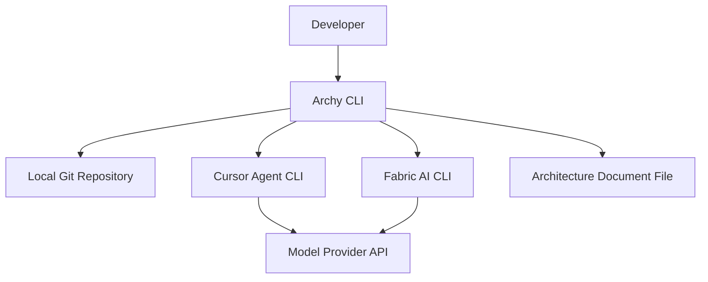
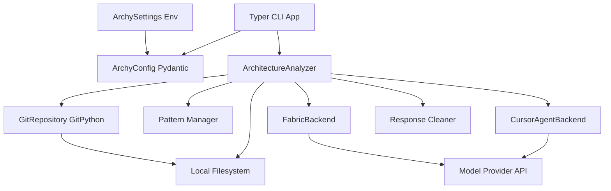
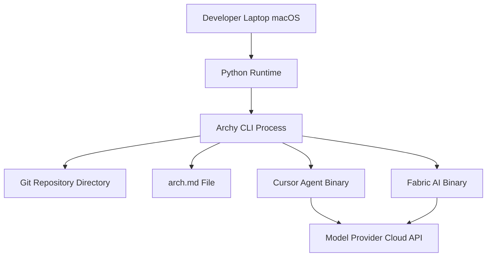

## BUSINESS POSTURE

- Purpose: generate and update architecture design documents with C4 diagrams from local code and git diffs
- Priorities: developer productivity, local-first, deterministic outputs, fast feedback with progress, minimal setup
- Scope: local CLI workflow inside a git repository; integrates with Cursor Agent CLI or Fabric AI CLI
- Constraints: operates within repo boundaries, respects .gitignore, supports monorepos and subfolders via path filters

Business risks:
- Stale or inaccurate documentation if generation drifts from code or fails silently
- Sensitive repository context leaving the machine via external AI backends
- Misplaced or destructive file writes due to path misuse
- Dependency drift in external CLIs or Python libraries
- Partial updates missing relevant files if filters are misconfigured

## SECURITY POSTURE

security control: Path validation and safe character enforcement for `project_path`, `subfolder`, `arch_filename` in `ArchyConfig`  
security control: Write-permission checks and directory creation limited to project paths  
security control: Git operations via GitPython with controlled path filters and exclusions  
security control: Subprocess calls to `cursor-agent` and `fabric-ai` with timeouts and stderr capture  
security control: No shell expansion; arguments passed as lists to subprocess  
security control: Response cleaning to strip non-content before persistence  
security control: Excluded file patterns for noisy or risky artifacts (minified, binaries, lockfiles)  
security control: Environment-driven defaults via `ArchySettings` with namespaced variables

accepted risk: External AI backends may receive summaries and prompts derived from local code  
accepted risk: Local documentation writes modify files inside the repository  
accepted risk: Availability and behavior of `cursor-agent` and `fabric-ai` binaries on developer machines

Recommended high-priority controls:
- security control: Prompt redaction of secrets and high-sensitivity tokens prior to egress
- security control: Dry-run mode with diff preview; opt-in to write
- security control: Pre-commit hooks for secret scanning and Mermaid validation
- security control: Dependency pinning and SBOM; periodic vulnerability scans
- security control: Minimal egress allowlist for subprocesses; proxy enforcement if available

Security requirements:
- Least-privilege file IO confined to the repository
- Deterministic, idempotent generation to reduce noisy diffs
- TLS for all outbound traffic from AI backends; token-based auth isolation
- Clear non-zero exits on failures; actionable errors
- Compatibility with enterprise macOS controls and EDR

## DESIGN

### C4 CONTEXT

| Name | Type | Description | Responsibilities | Security controls |
|---|---|---|---|---|
| Developer | Person | Engineer running the tool | Triggers fresh or update flows | Local execution; explicit command invocation |
| Archy CLI | System | Typer-based CLI entrypoint | Orchestrates analysis and persistence | Validates args; bounded execution |
| Local Git Repository | External System | Repo on disk | Source of code, diffs, paths | Read-only by default; filtered access |
| Cursor Agent CLI | External System | Cursor AI CLI | LLM generation backend | TLS, API keys, timeouts |
| Fabric AI CLI | External System | Fabric CLI | Local or proxied LLM backend | Timeouts, stderr capture |
| Model Provider API | External System | LLM endpoint | Text generation | TLS, auth, quotas |
| Architecture Document File | External System | Markdown in repo | Persisted design doc with C4 diagrams | Atomic writes, path allowlist |

### C4 CONTAINER

| Name | Type | Description | Responsibilities | Security controls |
|---|---|---|---|---|
| Typer CLI App | Container | `src/archy/cli.py` | Parse args, progress UI, route commands | Input validation, clear exits |
| ArchyConfig Pydantic | Container | `src/archy/core/config.py` | Validate paths, derive git context | Safe chars, path allowlist, write checks |
| ArchySettings Env | Container | `src/archy/core/config.py` | Defaults via env | Namespaced vars, sane limits |
| ArchitectureAnalyzer | Container | `src/archy/core/analyzer.py` | Build prompts, call backends, save docs | Change scoping, response cleaning |
| GitRepository GitPython | Container | `src/archy/core/git_ops.py` | Diff, list tracked files, branches | Controlled filters, error handling |
| Pattern Manager | Container | `src/archy/core/patterns.py` | Prompt templates for fresh/update | Local-only templates, versioned |
| CursorAgentBackend | Container | `src/archy/backends/cursor_agent.py` | Subprocess to `cursor-agent` | Timeouts, stderr capture, JSON parse |
| FabricBackend | Container | `src/archy/backends/fabric.py` | Subprocess to `fabric-ai` | Timeouts, stderr handling |
| Response Cleaner | Container | `clean_architecture_response` | Strip non-doc content | Deterministic extraction |
| Local Filesystem | External Container | Project directory | Read code, write `arch.md` | Atomic writes, scoped paths |
| Model Provider API | External Container | LLM service | Generate text | TLS, auth, quotas |

### C4 DEPLOYMENT

| Name | Type | Description | Responsibilities | Security controls |
|---|---|---|---|---|
| Developer Laptop macOS | Node | Local workstation | Host runtime and binaries | OS hardening, EDR |
| Python Runtime | Runtime | Python 3.x | Execute Archy | Least privilege |
| Archy CLI Process | Process | Typer app | Orchestrate analysis and writes | Timeouts, error handling |
| Git Repository Directory | Storage | Project on disk | Inputs and outputs | Access control, backups |
| arch.md File | Artifact | Design document | Persist architecture | Atomic writes |
| Cursor Agent Binary | Runtime | External CLI | LLM interaction | TLS, token isolation |
| Fabric AI Binary | Runtime | External CLI | LLM interaction | Timeouts, stderr capture |
| Model Provider Cloud API | Service | LLM API | Text generation | TLS, auth, quotas |

## RISK ASSESSMENT

- Critical business processes to protect: initial document generation; update from git diffs; consistent patterns; valid C4 Mermaid output; deterministic saves to `arch.md`
- Data to protect and sensitivity: source code and diffs (high, proprietary); prompts and generated outputs (medium, may summarize sensitive code); model provider credentials (high); architecture documents (medium, internal)

## QUESTIONS & ASSUMPTIONS

Questions:
- Which AI backend is the primary default for teams, and what are approved model providers and retention policies?
- What redaction rules should be enforced for prompts and directory paths?
- Should generation be dry-run by default with explicit confirmation to write?
- What diff base should be enforced in multi-remote setups?

Assumptions:
- Tool runs locally; no long-lived server; network egress only via selected AI backend
- `cursor-agent` and `fabric-ai` are installed and managed by developers
- Generated `arch.md` is committed to the repository
- Patterns are local and versioned within `patterns` directory
- macOS environment with Python, Git, and required CLIs available