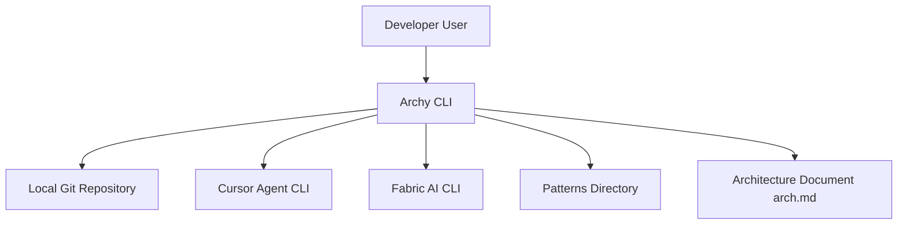
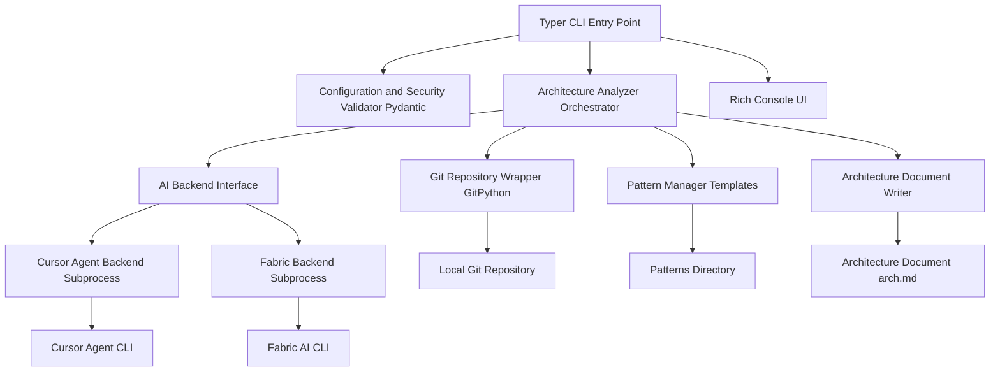
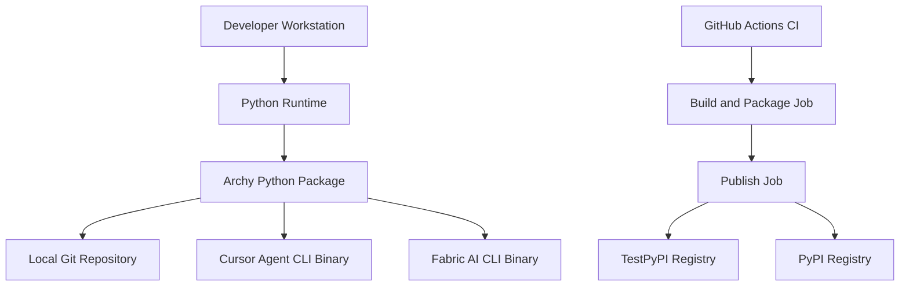

## BUSINESS POSTURE

- Product: Archy CLI generates C4 architecture documentation from a codebase using AI backends
- Primary users: developers, tech leads, architects who need accurate, up-to-date system documentation
- Objectives:
  - Automate architecture discovery using real repository structure and git history
  - Produce high-quality C4 diagrams and concise design docs quickly
  - Support both local models and cloud AI via pluggable backends
- Key business risks:
  - Inaccurate or incomplete diagrams reduce trust and adoption
  - External AI backend failures degrade UX and block workflows
  - Accidental inclusion of sensitive content from repos in generated docs
  - Supply chain risks in publishing and distributing the CLI

## SECURITY POSTURE

- Existing controls
  - security control: Input path validation and traversal prevention in `ArchyConfig` (safe characters, blocked system dirs, write permission checks)
  - security control: Git operations via GitPython with controlled path filtering
  - security control: Dry-run mode to avoid executing backend calls or writing files
  - security control: Backend subprocess timeouts and error handling in `AIBackend._run_command`
  - security control: Linting and type checking in CI (ruff, mypy)
  - security control: Tests and packaging checks executed in CI
  - security control: Dependabot configuration for automated dependency updates
  - security control: GitHub Actions concurrency control to prevent overlapping runs
  - security control: Trusted publishing to PyPI/TestPyPI using OIDC id-token (no persistent API tokens in CI)
  - security control: Pattern-managed prompt assembly with explicit file lists and exclusions

- Accepted risks
  - accepted risk: Reliance on external CLIs `cursor-agent` and `fabric-ai` for AI inference
  - accepted risk: Local filesystem access to repositories during analysis
  - accepted risk: Potential inclusion of sensitive strings present in the repository in generated outputs
  - accepted risk: Minimal dependency pinning in `pyproject.toml` may allow upstream changes between releases

- Recommended high-priority controls
  - security control: Secrets scanning and redaction before prompt assembly and before saving generated documents
  - security control: Allow-list based file inclusion and size caps; skip binary/large files aggressively
  - security control: Telemetry-free defaults and explicit user notice when a backend may send data off-machine
  - security control: SBOM generation and supply chain scanning in CI (e.g., pip-audit)
  - security control: Strict dependency version pinning for releases; lockfile for reproducible builds
  - security control: Release artifact signing and provenance (e.g., Sigstore, SLSA level targets)
  - security control: Optional sandboxing of subprocess backends with restricted environment

- Security requirements
  - The tool must not exfiltrate repository contents without explicit user action
  - All file outputs must respect target directory permission checks
  - Backend timeouts and retries must be bounded and observable
  - CI release workflow must use trusted publishing and not embed credentials
  - Generated documentation must avoid including secrets or API keys if present in code

## DESIGN

### C4 CONTEXT

| Name                | Type           | Description                                          | Responsibilities                                        | Security controls |
|---------------------|----------------|------------------------------------------------------|---------------------------------------------------------|------------------|
| Developer User      | Person         | Engineer invoking the CLI                            | Runs commands, reviews outputs                          | n/a |
| Archy CLI           | System         | Python CLI generating architecture docs              | Analyze repo, build prompts, call AI, write docs        | Path validation, write permission checks, timeouts |
| Local Git Repository| External System| Project source managed via GitPython                 | Provide tracked files and diffs                         | Path filtering, excluded pattern filtering |
| Cursor Agent CLI    | External System| AI backend binary for cloud inference                | Transform prompts to documentation                      | Subprocess timeout, availability check |
| Fabric AI CLI       | External System| AI backend for local models                          | Offline/local inference                                 | Subprocess timeout, availability check |
| Patterns Directory  | External Data  | Prompt templates used to guide analysis              | Provide structured instructions to backends             | Controlled file reads |
| Architecture Document arch.md | Data | Generated design document with C4 diagrams           | Persist final output                                    | Safe file write, overwrite checks |

### C4 CONTAINER

| Name                          | Type        | Description                                              | Responsibilities                                              | Security controls |
|-------------------------------|-------------|----------------------------------------------------------|---------------------------------------------------------------|------------------|
| Typer CLI Entry Point         | Container   | Command-line interface using Typer                       | Parse args, route commands, display status                    | n/a |
| Configuration and Security Validator | Container | Pydantic-based config and validation                     | Validate paths, backend choice, arch file location            | Path traversal prevention, write checks |
| Architecture Analyzer Orchestrator | Container | Core orchestration logic                                 | Build prompts, call backends, handle fresh/update modes       | Bounded operations, error handling |
| Git Repository Wrapper GitPython | Container | GitPython-based repo access                              | List tracked files, compute diffs, filter exclusions          | Path filtering, exception handling |
| Pattern Manager Templates     | Container   | Load and combine pattern templates                       | Provide consistent instructions to backends                   | Controlled file reads |
| AI Backend Interface          | Container   | Abstract adapter for AI backends                         | Normalize calls, implement timeouts and retries               | Subprocess timeouts, error mapping |
| Cursor Agent Backend Subprocess | Container | Adapter around `cursor-agent` binary                      | Execute remote AI inference                                   | Availability check, timeouts |
| Fabric Backend Subprocess     | Container   | Adapter around `fabric-ai` binary                         | Execute local model inference                                 | Availability check, timeouts |
| Architecture Document Writer  | Container   | File writer for `arch.md`                                | Persist cleaned content                                       | Overwrite safety, permission checks |
| Rich Console UI               | Container   | Console rendering using Rich                             | Progress, tables, statuses                                    | n/a |
| Local Git Repository          | External    | Local repository                                         | Source of truth for analysis                                  | n/a |
| Cursor Agent CLI              | External    | External AI CLI                                          | Inference for cloud-backed models                             | n/a |
| Fabric AI CLI                 | External    | External AI CLI                                          | Inference for local models                                    | n/a |
| Patterns Directory            | External    | Template files                                           | Supply prompt patterns                                        | n/a |
| Architecture Document arch.md | Data        | Output file                                              | Store final documentation                                     | n/a |

### C4 DEPLOYMENT

| Name                 | Type            | Description                                          | Responsibilities                                        | Security controls |
|----------------------|-----------------|------------------------------------------------------|---------------------------------------------------------|------------------|
| Developer Workstation| Node            | User machine (macOS, Windows, Linux)                 | Run CLI locally                                         | Local OS controls |
| Python Runtime       | Runtime         | Python interpreter                                   | Execute Archy code                                      | Virtual env isolation |
| Archy Python Package | Application     | Installed `archy` package                            | Provide CLI and logic                                   | Dependency constraints |
| Local Git Repository | Data/Service    | Project repo on disk                                 | Source for analysis                                     | Local FS permissions |
| Cursor Agent CLI Binary | External Tool| Installed `cursor-agent`                             | AI backend execution                                    | Process timeouts |
| Fabric AI CLI Binary | External Tool   | Installed `fabric-ai`                                | Local AI backend execution                              | Process timeouts |
| GitHub Actions CI    | CI Platform     | GitHub-hosted runners                                | Run tests, build artifacts                              | Concurrency control |
| Build and Package Job| CI Job          | Build wheels/sdist, verify                           | Ensure build integrity                                   | Isolation on runner |
| Publish Job          | CI Job          | Trusted publish to registries                        | Upload artifacts                                        | OIDC id-token, no static secrets |
| TestPyPI Registry    | Registry        | Test package distribution endpoint                   | Receive test releases                                   | Registry auth via OIDC |
| PyPI Registry        | Registry        | Production package registry                          | Receive official releases                               | Registry auth via OIDC |

## RISK ASSESSMENT

- Critical business processes to protect
  - Reliable generation of accurate architecture documentation from repositories
  - Safe interaction with external AI backends without leaking sensitive content
  - Secure build and publication pipeline for distributing the CLI

- Data to protect and sensitivity
  - Source code and configuration files from local repositories: high sensitivity
  - Generated documents that may include architectural details: medium sensitivity
  - CI secrets and publishing credentials (via OIDC tokens): high sensitivity

## QUESTIONS & ASSUMPTIONS

- Questions
  - Should generated documents automatically exclude files matching a secrets pattern, or require explicit opt-in to include sensitive paths?
  - Is offline-only operation required for some users, mandating `fabric-ai` as default in certain environments?
  - What maximum repository size or file size thresholds should be enforced by default?
  - Should telemetry be disabled by default, and are there corporate policies on data egress?

- Assumptions
  - Users understand that `cursor-agent` may transmit prompts off-machine, while `fabric-ai` can operate locally
  - Repository content analyzed is limited to tracked files and excludes common lock and binary artifacts
  - CI trusted publishing remains configured with OIDC and does not rely on long-lived tokens
  - Dependency updates are managed via Dependabot, with manual review before release