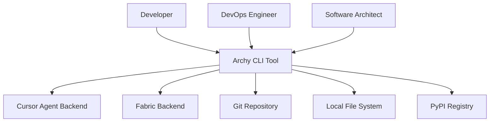
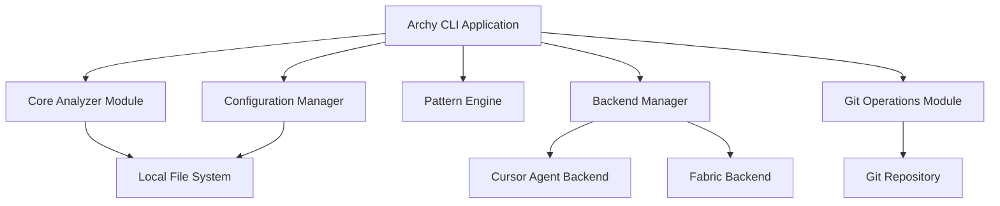
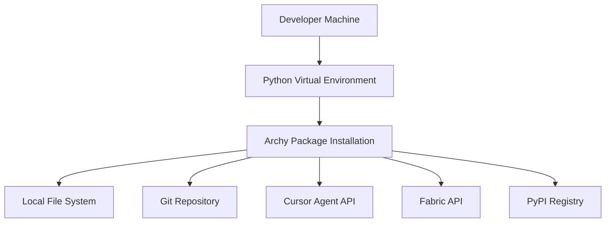

## BUSINESS POSTURE

**Business Priorities and Goals:**
- Provide automated software architecture analysis and documentation generation
- Enable developers to create comprehensive C4 model diagrams and design documents
- Support multiple AI backends (Cursor Agent, Fabric) for flexible architecture analysis
- Streamline the process of maintaining up-to-date system documentation
- Reduce manual effort in creating and updating architectural diagrams

**Key Business Risks:**
- Risk of outdated or inaccurate architectural documentation leading to poor system understanding
- Risk of inconsistent documentation standards across development teams
- Risk of manual documentation processes becoming bottlenecks in development cycles
- Risk of architectural debt accumulation due to lack of systematic analysis

## SECURITY POSTURE

**Existing Security Controls:**
- security control: Pre-commit hooks configured for code quality and security checks
- security control: Dependabot configured for automated dependency vulnerability scanning
- security control: CI/CD pipeline with automated testing and validation
- security control: Python package isolation through virtual environments
- security control: Git-based version control with branch protection

**Accepted Risks:**
- accepted risk: Command-line tool execution requires appropriate system permissions
- accepted risk: AI backend integrations may process sensitive codebase information
- accepted risk: Generated documentation may contain system architecture details

**Recommended Security Controls:**
- security control: Implement input validation and sanitization for all user inputs
- security control: Add authentication and authorization for AI backend integrations
- security control: Implement secure configuration management for API keys and credentials
- security control: Add audit logging for all architecture analysis operations
- security control: Implement rate limiting for AI backend API calls
- security control: Add encryption for sensitive configuration data

**Security Requirements:**
- Secure handling of codebase analysis data
- Protection of AI backend API credentials
- Secure file system access for codebase scanning
- Input validation for all command-line arguments
- Secure communication with external AI services

## DESIGN

### C4 CONTEXT

| Name | Type | Description | Responsibilities | Security Controls |
|------|------|-------------|------------------|------------------|
| Developer | Person | Software developer using the tool | Execute architecture analysis, review generated documentation | User authentication, access control |
| DevOps Engineer | Person | Operations engineer managing deployments | Use tool for infrastructure documentation | Role-based access control |
| Software Architect | Person | System architect designing solutions | Create and maintain architectural documentation | Privileged access management |
| Archy CLI Tool | Software System | Main architecture analysis and documentation tool | Analyze codebases, generate C4 diagrams, create design documents | Input validation, secure file access |
| Cursor Agent Backend | External System | AI-powered code analysis service | Provide intelligent codebase analysis and recommendations | API authentication, rate limiting |
| Fabric Backend | External System | Alternative AI analysis service | Provide code analysis and pattern recognition | API key management, secure communication |
| Git Repository | External System | Version control system | Store and version codebase files | Repository access control, branch protection |
| Local File System | External System | Local development environment | Store codebase files and generated documentation | File system permissions, access control |
| PyPI Registry | External System | Python package repository | Distribute and manage Archy package | Package signing, integrity verification |

### C4 CONTAINER

| Name | Type | Description | Responsibilities | Security Controls |
|------|------|-------------|------------------|------------------|
| Archy CLI Application | Container | Main command-line interface | Parse commands, orchestrate analysis workflow | Input validation, error handling |
| Core Analyzer Module | Container | Codebase analysis engine | Analyze code structure, identify components | Secure file access, data sanitization |
| Backend Manager | Container | AI backend integration layer | Manage connections to AI services | API authentication, credential management |
| Pattern Engine | Container | Pattern recognition and documentation | Apply analysis patterns, generate documentation | Template validation, output sanitization |
| Git Operations Module | Container | Git repository interaction | Handle git operations, branch management | Repository access control, secure operations |
| Configuration Manager | Container | Configuration and settings management | Manage tool configuration, user preferences | Secure config storage, validation |
| Cursor Agent Backend | External Container | AI analysis service | Provide intelligent code analysis | API security, rate limiting |
| Fabric Backend | External Container | Alternative AI service | Provide code analysis capabilities | Secure API communication |
| Local File System | External Container | File system interface | Store and retrieve files | File permissions, access control |
| Git Repository | External Container | Version control system | Manage codebase versions | Repository security, branch protection |

### C4 DEPLOYMENT

| Name | Type | Description | Responsibilities | Security Controls |
|------|------|-------------|------------------|------------------|
| Developer Machine | Deployment Node | Local development workstation | Host the Archy tool and development environment | System security, user authentication |
| Python Virtual Environment | Deployment Node | Isolated Python runtime | Provide isolated package dependencies | Environment isolation, dependency management |
| Archy Package Installation | Deployment Node | Installed Archy package | Execute architecture analysis commands | Package integrity, secure execution |
| Local File System | Deployment Node | Local storage system | Store codebase files and generated documentation | File system security, access control |
| Git Repository | Deployment Node | Version control system | Manage codebase versions and history | Repository security, access control |
| Cursor Agent API | Deployment Node | External AI service endpoint | Provide code analysis services | API security, authentication |
| Fabric API | Deployment Node | External AI service endpoint | Provide alternative analysis services | Secure API communication |
| PyPI Registry | Deployment Node | Python package repository | Distribute and manage package versions | Package signing, integrity verification |

## RISK ASSESSMENT

**Critical Business Processes:**
- Software architecture documentation and maintenance
- Codebase analysis and pattern recognition
- AI-powered architectural recommendations
- Automated documentation generation

**Data Protection Requirements:**
- **High Sensitivity**: Source code and architectural details that may contain proprietary business logic
- **Medium Sensitivity**: Configuration files and project metadata
- **Low Sensitivity**: Generated documentation and analysis reports (unless containing sensitive architectural details)

## QUESTIONS & ASSUMPTIONS

**Business Posture Questions:**
- What is the target user base size and growth expectations?
- What are the primary use cases driving adoption?
- What is the expected frequency of architecture analysis operations?

**Security Posture Assumptions:**
- AI backends are trusted third-party services with appropriate security controls
- Local file system access is restricted to authorized users only
- Generated documentation may be shared within development teams
- API credentials are managed securely through environment variables or secure storage

**Design Assumptions:**
- Python 3.8+ runtime environment is available
- Git repository access is available for codebase analysis
- Network connectivity is available for AI backend services
- Local file system has sufficient storage for generated documentation
- Users have appropriate permissions to read codebase files and write generated documentation