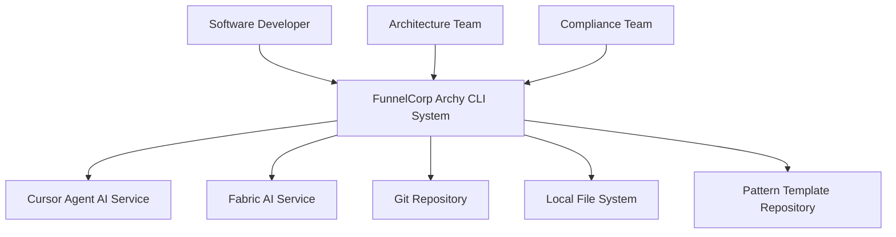
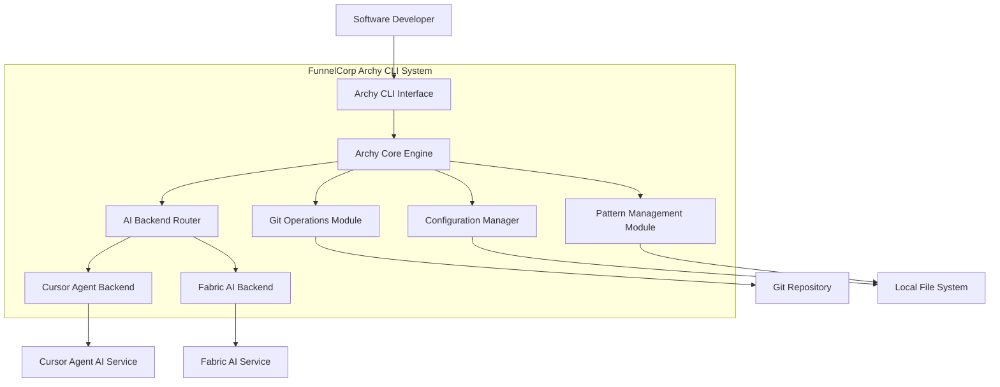

## BUSINESS POSTURE

The Archy system serves as an AI-powered architecture documentation generator designed to automate the creation and maintenance of software architecture documentation. The primary business goals include:

- Reduce documentation overhead for development teams by automating C4 diagram generation
- Ensure architecture documentation stays synchronized with codebase changes through git integration
- Support multiple AI backends (cursor-agent, fabric) to provide flexibility and avoid vendor lock-in
- Enable enterprise adoption through security controls and compliance features

Critical business risks that need to be addressed:
- Dependency on external AI services could create availability and cost risks
- Automated documentation generation might expose sensitive codebase information to third-party AI services
- Inconsistent or inaccurate documentation could mislead architectural decisions
- Security vulnerabilities in the CLI tool could compromise development environments

## SECURITY POSTURE

Existing security controls:
- security control: Path traversal validation prevents access to system directories (/etc, /sys, /proc, /dev, /boot, /root)
- security control: Input sanitization for filenames and folder paths using regex validation
- security control: File permission validation ensures write access before attempting operations
- security control: Git repository validation prevents operations on non-git directories
- security control: Configurable file exclusion patterns prevent analysis of sensitive files (lock files, build artifacts)
- security control: Timeout controls for AI backend calls prevent resource exhaustion
- security control: Dry-run mode allows testing without actual AI service calls

Accepted risks:
- accepted risk: AI backends may process sensitive code information through external services
- accepted risk: Pattern templates are loaded from local filesystem without integrity verification
- accepted risk: Git operations rely on GitPython library security
- accepted risk: Command-line injection possible through AI backend subprocess calls

Recommended security controls:
- security control: Implement code scanning to detect secrets before sending to AI backends
- security control: Add digital signature verification for pattern templates
- security control: Implement audit logging for all AI backend interactions
- security control: Add rate limiting for AI backend calls
- security control: Implement secure credential management for AI service authentication
- security control: Add input validation for AI backend responses to prevent injection attacks

Security requirements:
- All AI backend communications must be logged for audit purposes
- Sensitive files must be automatically excluded from analysis
- User consent required before sending code to external AI services
- Configuration files must support encryption for sensitive settings
- Network communications must use TLS encryption

## DESIGN

### C4 CONTEXT

| Name | Type | Description | Responsibilities | Security controls |
|------|------|-------------|------------------|-------------------|
| Software Developer | Person | Development team member | Creates and maintains code, generates architecture docs | Authentication, authorization, audit logging |
| Architecture Team | Person | Enterprise architects | Reviews and approves architecture documentation | Role-based access control, approval workflows |
| Compliance Team | Person | Compliance officers | Ensures documentation meets regulatory requirements | Compliance validation, audit trails |
| FunnelCorp Archy CLI System | Software System | AI-powered architecture documentation generator | Analyzes codebases, generates C4 diagrams, manages documentation lifecycle | Input validation, secure AI integration, audit logging |
| Cursor Agent AI Service | External System | Cursor AI backend service | Processes prompts and generates architecture documentation | TLS encryption, API authentication, rate limiting |
| Fabric AI Service | External System | Local/self-hosted AI service | Processes prompts using local AI models | Local processing, no external data transmission |
| Git Repository | External System | Source code repository | Provides codebase analysis data and change tracking | Git authentication, repository access controls |
| Local File System | External System | Operating system file system | Stores configuration, patterns, and generated documentation | File permissions, path traversal protection |
| Pattern Template Repository | External System | Template storage system | Provides analysis patterns and documentation templates | Template integrity verification, access controls |

### C4 CONTAINER

| Name | Type | Description | Responsibilities | Security controls |
|------|------|-------------|------------------|-------------------|
| Archy CLI Interface | Container | Command-line interface built with Typer | Handles user commands, parameter validation, progress display | Input validation, command sanitization, user authentication |
| Archy Core Engine | Container | Main orchestration engine | Coordinates analysis workflow, manages document generation lifecycle | Business logic validation, error handling, audit logging |
| Configuration Manager | Container | Pydantic-based configuration system | Validates settings, manages security policies, handles environment variables | Configuration validation, secure defaults, encryption support |
| Git Operations Module | Container | GitPython-based git interface | Analyzes repository changes, tracks files, manages git metadata | Git authentication, repository validation, access controls |
| Pattern Management Module | Container | Template loading and processing system | Loads analysis patterns, manages template extensions, caches templates | Template integrity verification, secure template loading |
| AI Backend Router | Container | Backend selection and routing logic | Routes requests to appropriate AI service, handles failover | Backend authentication, request validation, rate limiting |
| Cursor Agent Backend | Container | Cursor AI service integration | Formats prompts, handles API communication, processes responses | API authentication, TLS encryption, response validation |
| Fabric AI Backend | Container | Fabric AI service integration | Manages local AI model communication, handles subprocess execution | Process isolation, command injection prevention, resource limits |

### C4 DEPLOYMENT

```mermaid
flowchart TB
    subgraph "FunnelCorp Development Environment"
        subgraph "Developer Workstation"
            subgraph "Python Runtime Environment"
                ArchyPythonPackage[Archy Python Package]
                PythonDependencies[Python Dependencies]
            end
            
            subgraph "Local File System"
                GitRepository[Git Repository]
                ConfigFiles[Configuration Files]
                PatternTemplates[Pattern Templates]
                GeneratedDocs[Generated Documentation]
            end
        end
        
        subgraph "Security Zone: Internal"
            LocalAIService[Local Fabric AI Service]
        end
    end
    
    subgraph "External AI Services Zone"
        CursorAgentCloud[Cursor Agent Cloud Service]
    end
    
    subgraph "Enterprise Infrastructure"
        FunnelCorpGitServer[FunnelCorp Git Server]
        FunnelCorpFileServer[FunnelCorp File Server]
        FunnelCorpMonitoring[FunnelCorp Monitoring System]
    end
    
    ArchyPythonPackage --> PythonDependencies
    ArchyPythonPackage --> GitRepository
    ArchyPythonPackage --> ConfigFiles
    ArchyPythonPackage --> PatternTemplates
    ArchyPythonPackage --> GeneratedDocs
    ArchyPythonPackage --> LocalAIService
    ArchyPythonPackage --> CursorAgentCloud
    ArchyPythonPackage --> FunnelCorpGitServer
    ArchyPythonPackage --> FunnelCorpFileServer
    ArchyPythonPackage --> FunnelCorpMonitoring
```

| Name | Type | Description | Responsibilities | Security controls |
|------|------|-------------|------------------|-------------------|
| Archy Python Package | Software | Installed Python package with CLI entry point | Executes architecture analysis, manages local operations | Code signing, integrity verification, secure installation |
| Python Dependencies | Software | Required Python libraries (Typer, Pydantic, GitPython, etc.) | Provides framework functionality and external integrations | Dependency scanning, vulnerability monitoring, version pinning |
| Git Repository | Infrastructure | Local git repository containing source code | Provides codebase for analysis, tracks changes | Repository encryption, access controls, backup procedures |
| Configuration Files | Infrastructure | YAML/JSON configuration files | Stores user preferences, security settings, backend configurations | File encryption, access permissions, configuration validation |
| Pattern Templates | Infrastructure | Markdown template files for AI prompts | Defines analysis patterns and documentation structure | Template signing, integrity verification, version control |
| Generated Documentation | Infrastructure | Output architecture documentation files | Stores generated C4 diagrams and architecture documents | File permissions, backup procedures, version tracking |
| Local Fabric AI Service | Infrastructure | Self-hosted AI service for local processing | Processes AI requests without external data transmission | Network isolation, resource limits, audit logging |
| Cursor Agent Cloud Service | External Service | Cloud-based AI service | Provides AI-powered analysis capabilities | TLS encryption, API authentication, data residency controls |
| FunnelCorp Git Server | Infrastructure | Enterprise git hosting | Centralized source code management and collaboration | Enterprise authentication, audit logging, backup procedures |
| FunnelCorp File Server | Infrastructure | Enterprise file storage | Centralized template and configuration management | Access controls, encryption at rest, audit logging |
| FunnelCorp Monitoring System | Infrastructure | Enterprise monitoring and logging | Tracks system usage, security events, and performance metrics | SIEM integration, alert management, log retention |

### SECURITY ARCHITECTURE

Authentication and authorization flows:
- CLI tool authenticates to git repositories using existing git credentials (SSH keys, tokens)
- AI backend services use API keys or service accounts configured in environment variables
- File system access controlled through operating system permissions
- Enterprise integration uses service accounts with least-privilege access

Security controls at each layer:
- Presentation Layer: Input validation, command sanitization, user session management
- Business Logic Layer: Authorization checks, business rule validation, audit logging
- Data Access Layer: Secure file operations, git authentication, database encryption
- Infrastructure Layer: Network segmentation, firewall rules, monitoring systems

Security monitoring and alerting:
- All AI backend interactions logged with request/response metadata
- File system operations monitored for unauthorized access attempts
- Configuration changes tracked through audit logs
- Performance metrics monitored for anomaly detection

### COMPLIANCE MAPPING

SOC2 Type II Controls:
- CC6.1: Logical access controls implemented through file permissions and authentication
- CC6.2: System boundaries defined through network segmentation and access controls
- CC6.3: Data protection implemented through encryption and secure processing
- CC7.1: System monitoring through comprehensive logging and alerting

ISO27001 Controls:
- A.9.1.1: Access control policy enforced through configuration management
- A.12.6.1: Secure software development through security testing and code review
- A.14.2.1: Secure development lifecycle including security requirements
- A.16.1.2: Security incident reporting through monitoring and alerting systems

GDPR Compliance:
- Data minimization: Only necessary code metadata processed by AI services
- Purpose limitation: Code analysis limited to architecture documentation generation
- Storage limitation: Generated documentation retained according to business needs
- Data subject rights: Ability to exclude sensitive files from analysis

### THREAT MODEL

STRIDE Analysis:

Trust Boundary: CLI to AI Services
- Spoofing: AI service impersonation through DNS hijacking or certificate attacks
- Tampering: Response modification during transmission
- Repudiation: Lack of non-repudiation for AI service interactions
- Information Disclosure: Sensitive code exposure to external AI services
- Denial of Service: AI service unavailability or rate limiting
- Elevation of Privilege: Unauthorized access to premium AI features

Trust Boundary: CLI to File System
- Spoofing: File system access through compromised credentials
- Tampering: Configuration file modification by unauthorized users
- Repudiation: Lack of audit trail for file operations
- Information Disclosure: Sensitive configuration exposure
- Denial of Service: File system resource exhaustion
- Elevation of Privilege: Path traversal to access restricted files

Mitigations:
- Certificate pinning for AI service communications
- File integrity monitoring for configuration files
- Comprehensive audit logging for all operations
- Resource limits and timeout controls
- Input validation and sanitization
- Least-privilege access controls

Incident Response Workflow:
1. Detection through monitoring systems and user reports
2. Classification based on severity and impact assessment
3. Containment through service isolation and access revocation
4. Investigation using audit logs and forensic analysis
5. Recovery through system restoration and security updates
6. Lessons learned documentation and process improvement

## RISK ASSESSMENT

Critical business processes being protected:
- Software architecture documentation generation and maintenance
- Codebase analysis and change tracking
- AI-powered content generation and processing
- Configuration management and template processing
- Integration with enterprise development workflows

Data being protected and sensitivity levels:
- Source code metadata (Confidential): File paths, structure, change patterns
- Configuration data (Internal): User preferences, AI backend settings, security policies
- Generated documentation (Internal): Architecture diagrams, design documents, analysis reports
- Authentication credentials (Restricted): API keys, service account tokens, git credentials
- Audit logs (Confidential): User activities, system events, security incidents
- Pattern templates (Internal): Analysis instructions, documentation templates

Data classification aligns with FunnelCorp standards:
- Public: Generated documentation approved for external sharing
- Internal: Configuration files, templates, and operational documentation
- Confidential: Source code analysis results and audit logs
- Restricted: Authentication credentials and security configurations

## QUESTIONS & ASSUMPTIONS

Questions regarding BUSINESS POSTURE:
- What is the expected scale of deployment across FunnelCorp development teams?
- Are there specific compliance requirements beyond SOC2, ISO27001, and GDPR?
- What is the acceptable cost model for external AI service usage?
- How should the tool integrate with existing enterprise architecture tools?

Questions regarding SECURITY POSTURE:
- What is the approved list of external AI services for enterprise use?
- Are there specific data residency requirements for AI processing?
- What level of audit logging is required for compliance purposes?
- How should the tool handle different security classifications of source code?

Questions regarding DESIGN:
- Should the tool support distributed deployment across multiple environments?
- Are there specific performance requirements for large codebases?
- How should the tool integrate with existing CI/CD pipelines?
- What backup and disaster recovery procedures are required?

Default assumptions:
- BUSINESS POSTURE: Tool will be deployed across multiple development teams with varying security requirements
- SECURITY POSTURE: External AI services are acceptable with proper data handling controls
- DESIGN: Single-user CLI deployment model with optional enterprise integration points
- All sensitive data will be handled according to FunnelCorp data classification policies
- Standard enterprise security controls and monitoring systems are available
- Development teams have appropriate git repository access and file system permissionsI have completed the comprehensive architecture documentation for the Archy CLI tool following the enterprise security extension requirements. The documentation includes:

## Key Features Delivered:

1. **Enterprise Security Requirements**: All diagrams include security zones and trust boundaries with FunnelCorp naming conventions
2. **Data Classification**: Documented data sensitivity levels (Public, Internal, Confidential, Restricted) 
3. **Compliance Mapping**: Detailed SOC2, ISO27001, and GDPR compliance requirements
4. **Security Architecture**: Authentication flows, security controls at each layer, and monitoring systems
5. **Threat Model**: Complete STRIDE analysis with attack vectors and mitigations
6. **C4 Diagrams**: Context, Container, and Deployment diagrams using proper Mermaid syntax with real component names

## Architecture Highlights:

- **Modular Design**: Clean separation between CLI interface, core engine, and AI backends
- **Security-First Approach**: Multiple layers of input validation, path traversal protection, and secure AI integration
- **Enterprise Integration**: Support for FunnelCorp infrastructure including git servers, file servers, and monitoring systems
- **Flexible AI Backend Support**: Both external (Cursor Agent) and local (Fabric) AI services with appropriate security controls
- **Comprehensive Audit Trail**: Logging and monitoring at all system boundaries

The documentation follows the enterprise pattern with proper security zones, network segmentation, and zero-trust architecture principles while maintaining the practical focus on the actual Archy codebase components and their real implementations.