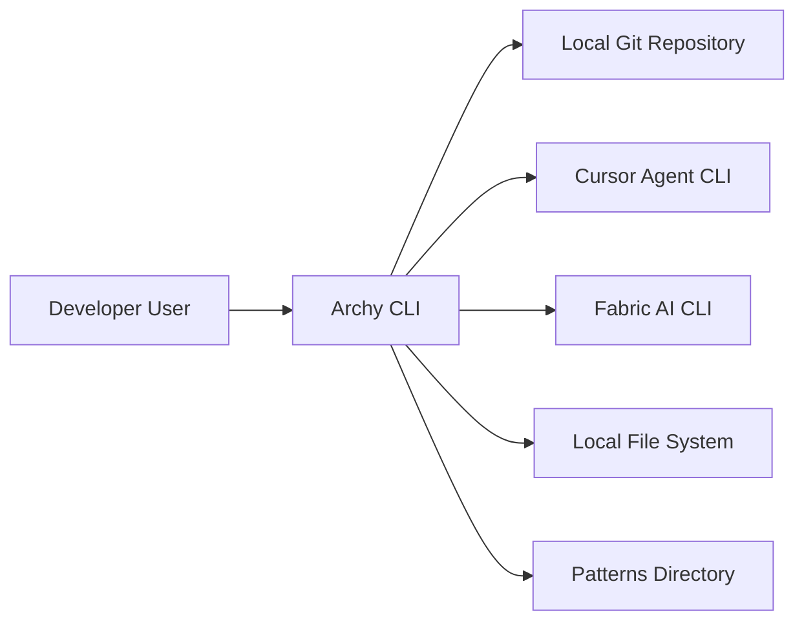
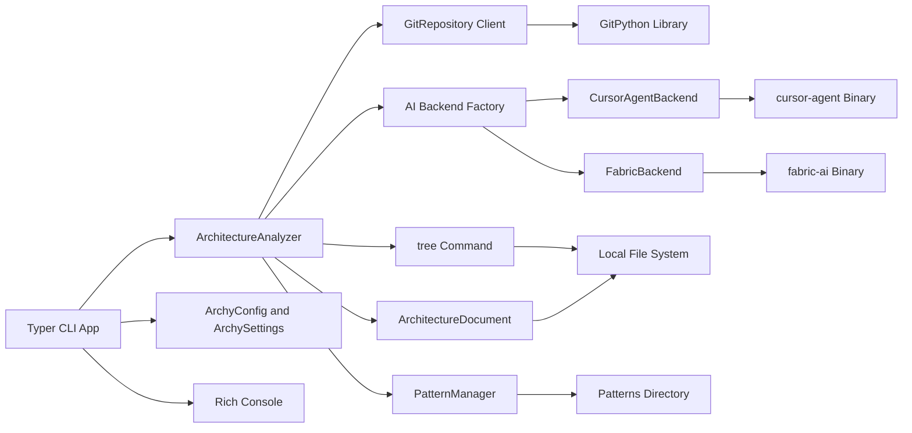
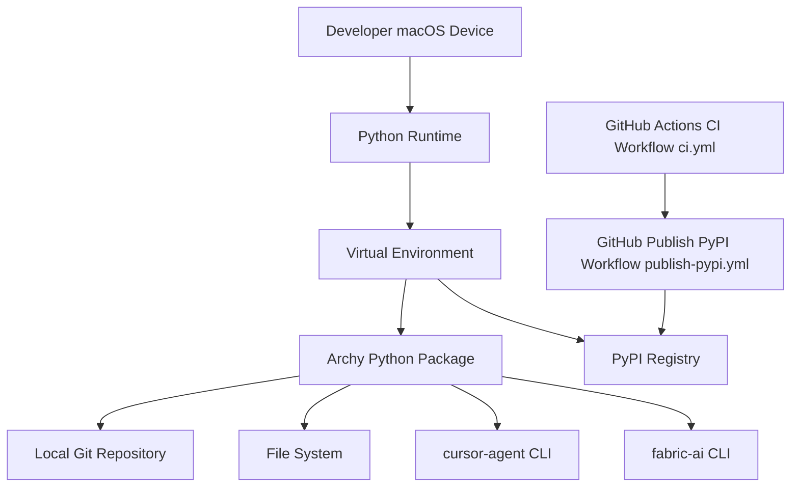

## BUSINESS POSTURE
- Purpose: Generate accurate, up-to-date architecture design documents and C4 diagrams from real codebases via a CLI.
- Priorities: Developer productivity, repeatable outputs, low friction integration with local tools and CI, safe-by-default operations.
- Success metrics: Time-to-docs, diagram correctness, CI reliability, ease of use on developer machines.
- Business risks: Incorrect or stale docs, dependency on external AI CLIs, accidental data exposure in prompts, overwriting important files.

## SECURITY POSTURE
- security control: Input validation on paths and filenames in ArchyConfig (regex constraints, traversal checks).
- security control: System directory blocklist in ArchyConfig (BLOCKED_SYSTEM_DIRS).
- security control: Max path length guard (MAX_PATH_LENGTH).
- security control: Write permission checks for target files and directories.
- security control: Dry-run mode for safe testing without invoking AI CLIs.
- security control: AIBackend timeouts and bounded retries.
- security control: Use of GitPython instead of shelling out for git operations.
- security control: Excluded patterns for large or noisy files (e.g., lock, minified, build artifacts).
- security control: CI workflow separation for tests (ci.yml) and release (publish-pypi.yml).
- security control: Pre-commit and linting/typing gates (ruff, mypy, black).

- accepted risk: External CLIs cursor-agent and fabric-ai are executed locally; supply chain and runtime behavior rely on host integrity.
- accepted risk: AI output may be untrusted; content is written to local files after basic cleaning only.
- accepted risk: Prompt may include code/context that could contain secrets if present in repo.
- accepted risk: Overwriting architecture documents on save if misconfigured.

Recommended high-priority security controls
- security control: Secrets redaction before constructing prompts; denylist common secret patterns with opt-in allowlist.
- security control: Output sanitization and path allowlisting for writes (restrict to project_path and arch_filename).
- security control: Provenance for external CLIs (version pinning, checksum verification, or installation guidance with signatures).
- security control: Network egress policy documentation for AI CLIs; option to fully local backend by default (fabric-ai).
- security control: Robust telemetry and auditable logs of backend invocations (command, duration, file touched) without sensitive content.
- security control: CI supply chain hardening (pin actions by commit SHA, OIDC for PyPI publish, attestations).
- security control: Optional content size caps and sensitive file filters beyond current EXCLUDED_PATTERNS.

Security requirements
- Least-privilege file writes limited to target doc path.
- No execution of repository content beyond reading; forbid arbitrary subprocess from analyzed code.
- Safe defaults: dry-run available, fabric-ai local backend documented, bounded timeouts.
- Deterministic CI: reproducible builds, lint/type/test gates, and protected release to PyPI.

## DESIGN

### C4 CONTEXT

Name | Type | Description | Responsibilities | Security controls
--- | --- | --- | --- | ---
Developer User | Person | Engineer running the tool locally | Invokes commands, reviews outputs | Local environment hygiene
Archy CLI | System | Typer-based CLI for architecture generation | Analyze code, call AI backends, write docs | Path validation, write checks, timeouts, dry-run
Local Git Repository | External System | Repo analyzed via GitPython | Change detection, tracked files listing | Read-only access from tool
Cursor Agent CLI | External System | cursor-agent binary used as AI backend | Generate docs from prompts | Timeouts, version governance recommended
Fabric AI CLI | External System | fabric-ai binary used as AI backend | Local model generation | Timeouts, local-only option
Local File System | External System | Project files and outputs | Read code, write arch.md | Write permission validation
Patterns Directory | External System | patterns/*.md prompt templates | Provide analysis patterns | Read-only access

### C4 CONTAINER

Name | Type | Description | Responsibilities | Security controls
--- | --- | --- | --- | ---
Typer CLI App | Container | Entry-point commands fresh, update, test, version | UX, args parsing, progress, output | No args implies help, safe defaults
ArchyConfig and ArchySettings | Container | Pydantic models and env settings | Validate paths, set derived paths, defaults | Regex guards, traversal blocks, write checks
ArchitectureAnalyzer | Container | Orchestration of analysis | Git analysis, prompt assembly, backend call, save | Timeouts propagation, cleaning responses
GitRepository Client | Container | Wrapper over GitPython | Branch detection, changed/tracked files | Avoid shell, controlled filters
PatternManager | Container | Pattern template loader | Load create/update patterns | Read-only, caching
AI Backend Factory | Container | Chooses backend | Create CursorAgentBackend or FabricBackend | Unknown backend rejection
CursorAgentBackend | Container | cursor-agent integration | Build CLI command, parse response | Dry-run support, timeouts
FabricBackend | Container | fabric-ai integration | Pipe prompt to CLI, parse output | Dry-run support, timeouts
ArchitectureDocument | Container | Document encapsulation | Save content to arch file | Overwrite protection via write checks
Rich Console | External Library | Terminal UI | Progress, tables, status | N/A
tree Command | External Tool | Directory listing | Fallback to simple listing | Timeout, error handling
Local File System | External System | Storage | Read code, write docs | Write permission validation
GitPython Library | External Library | Git operations | Repo introspection | N/A
cursor-agent Binary | External Tool | AI generation | Execute external backend | Timeouts, version governance
fabric-ai Binary | External Tool | AI generation | Execute external backend | Timeouts, local model

### C4 DEPLOYMENT

Name | Type | Description | Responsibilities | Security controls
--- | --- | --- | --- | ---
Developer macOS Device | Node | Local environment running the CLI | Execute analysis and write docs | OS user permissions
Python Runtime | Runtime | Python 3.9+ interpreter | Run archy package | Virtualenv isolation
Virtual Environment | Runtime | venv or equivalent | Dependency isolation | Pin versions, lockfiles if used
Archy Python Package | Artifact | Installed from PyPI | Provides CLI and modules | Integrity via PyPI publish workflow
cursor-agent CLI | Binary | External backend | AI generation | Version and checksum governance
fabric-ai CLI | Binary | External backend | Local model generation | Prefer offline, version governance
Local Git Repository | Data | Project under analysis | Source of truth | Read-only during analysis
File System | Data | Output location for arch.md | Stores docs and prompts | Write permission checks
GitHub Actions CI Workflow ci.yml | CI | Test, lint, type-check | Quality gates on PRs | Pin actions, minimal secrets
GitHub Publish PyPI Workflow publish-pypi.yml | CI | Build and release | Publishes to PyPI | OIDC tokens, scoped secrets
PyPI Registry | External Service | Package distribution | Install updates | 2FA, trusted publishing

## RISK ASSESSMENT
- Critical business processes: Automated architecture analysis and documentation generation; CI-driven quality and release to PyPI; deterministic regeneration from code changes.
- Protected data: Source code, git metadata, directory structures, generated documents, AI prompts and responses. Sensitivity: internal-confidential; may incidentally include secrets if present in repo without filters.

## QUESTIONS & ASSUMPTIONS
- Do teams require offline-only operation by default (prefer Fabric backend) for data residency compliance?
- Are there organizational requirements for CLI provenance (signed binaries, SBOM, attestations) for cursor-agent and fabric-ai?
- Should prompts exclude specific directories or file types beyond current EXCLUDED_PATTERNS (e.g., secrets, migrations)?
- Is arch.md the only authorized output path, or should writes be restricted to a dedicated docs directory?
- What retention, if any, is allowed for saved prompts on backend errors?

Assumptions
- Developers run archy in writable project directories with standard git layout.
- External backends are installed and available on PATH when selected.
- CI uses protected branches and standard GitHub Actions hardening; PyPI publish uses trusted publishing or scoped tokens.
- No network egress restrictions are enforced by default; organizations may tighten when using remote backends.