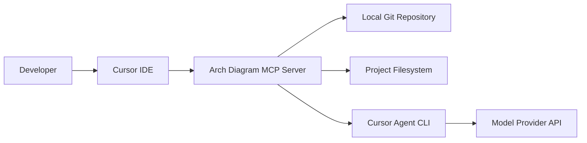
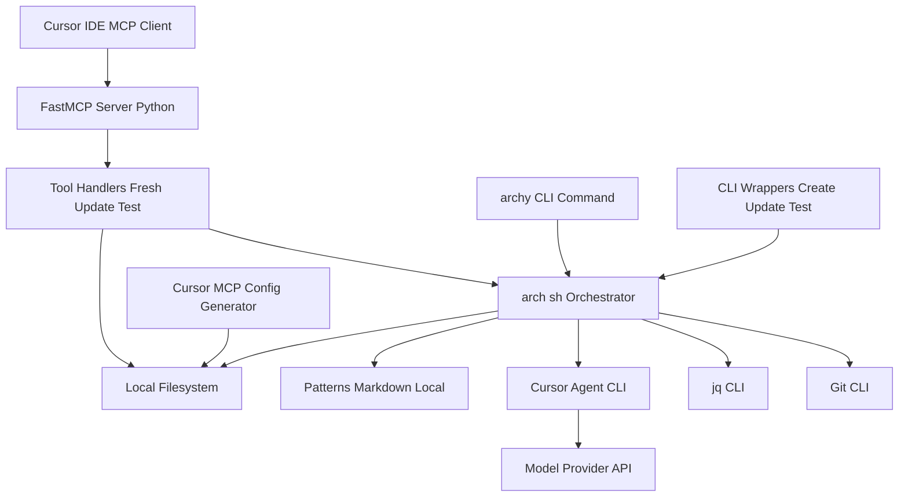
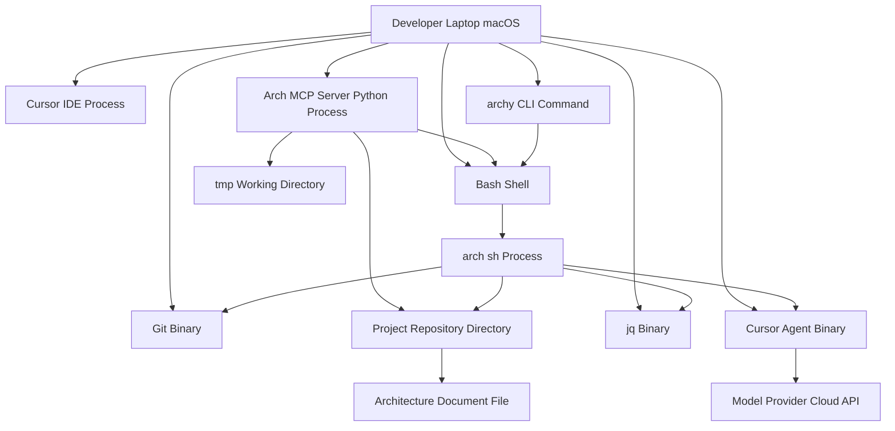

I'll fetch the latest from origin, then get the commit list and diff stats for your branch relative to origin/main to identify architecture-impacting changes.I'll get the commit list and diffs since origin/main to understand architecture-impacting changes.## BUSINESS POSTURE

- Purpose: automate creation and updates of architecture design documents with C4 diagrams from local code and git diffs
- Priorities: developer productivity, local-first workflow, reproducibility, fast feedback with progress, minimal setup
- Scope: runs on developer machines, integrated with Cursor via MCP, orchestrates bash scripts and patterns to generate docs
- Constraints: operates within repository boundaries, avoids long-lived processes, supports monorepos and subfolders
- [Updated] Local, versioned patterns only under patterns directory; remote fetch removed for determinism
- [Updated] Consistent CLI via archy command and interactive wrappers for fresh and update flows
- [Updated] Legacy pattern fetch scripts removed in favor of local patterns: cli/fetch_pattern.sh and scripts/fetch_fabric_pattern.sh deleted to eliminate remote sources and simplify the flow

Business risks:
- Inaccurate or stale documentation if generation drifts from code or fails silently
- Unintended egress of sensitive repository context to external model providers
- Destructive or misplaced file writes due to path misuse
- Supply chain exposure from external CLIs and remote pattern sources
- [Updated] Pattern updates require repo changes and reviews because remote fetch is removed
- [Updated] Reduced supply chain risk by removing remote pattern retrieval and curl-based fetch paths

## SECURITY POSTURE

security control: Subprocess execution via asyncio without shell expansion, no stdin  
security control: Script timeouts and progress reporting to prevent indefinite runs  
security control: Scripts use set -euo pipefail and explicit paths  
security control: Local MCP server only, no exposed network listener in default flow  
security control: Minimal dependencies, Python 3.10+  
security control: Stderr capture and structured parsing of outputs  
security control: Make scripts executable with explicit chmod before run  
[Updated] security control: Local, versioned patterns only; no runtime fetch from remote sources  
[Updated] security control: Path and filename validation for inputs and outputs in arch sh and archy  
[Updated] security control: Temp directory isolation with automatic cleanup via traps  
[Updated] security control: AI backend selection restricted to cursor agent or fabric with output normalization  
[Updated] security control: Network egress narrowed to model provider only; remote pattern fetch binaries and scripts removed

accepted risk: External model API may receive prompts and summaries from local repo  
accepted risk: Local scripts can modify repository files including documentation  
accepted risk: Dependence on installed git, jq, curl, cursor agent versions  
[Updated] accepted risk: Only file types covered by globs are analyzed during updates  
[Updated] removed risk: Remote pattern fetch drift due to pinning gaps is no longer applicable

Recommended high-priority controls:
- security control: Output path allowlist and filename normalization for generated artifacts
- security control: Dry run mode with diff preview, gated writes by user confirmation
- security control: Egress policy and redaction for prompts to model providers
- security control: Pin dependencies and produce SBOM; periodic vulnerability scans
- security control: Pre-commit hooks for secret scanning and document formatting
- security control: Append-only audit log of tool invocations and file writes
- security control: Checksums or pinned commit ref for fetched patterns
- security control: Configurable git diff base with repo default detection
- [Updated] recommendation: Validate and document AI backend setup and selection defaults

Security requirements:
- Least privilege file IO within project directories
- Deterministic, idempotent generation to reduce noisy diffs
- TLS for all outbound requests from CLIs; managed API keys
- No PII or secrets in prompts; redact sensitive paths and code
- Clear errors and non-zero exit on partial failures
- Compatibility with enterprise macOS controls and EDR
- [Updated] Enforce temp isolation and cleanup for all intermediate artifacts

## DESIGN

### C4 CONTEXT

[Updated] Removed GitHub Pattern Repository and related link since patterns are now local and versioned in repository.  
[Updated] Egress constrained to model provider only; no network calls for pattern retrieval.

| Name | Type | Description | Responsibilities | Security controls |
|---|---|---|---|---|
| Developer | Person | Engineer generating architecture docs | Triggers create or update flows | Local-only execution; explicit confirmation for writes |
| Cursor IDE | External System | IDE integrating MCP client | Hosts MCP connection and UI | Sandboxed tool execution, user consent |
| Arch Diagram MCP Server | System | Local FastMCP server exposing tools | Orchestrates scripts, validates inputs, reports progress | No shell expansion, timeouts, stderr capture |
| Local Git Repository | External System | Repo on disk | Provides code and diffs | Read-mostly, controlled write of docs |
| Project Filesystem | External System | Project directories and tmp | Stores generated docs and intermediates | Path allowlist, atomic writes |
| Cursor Agent CLI | External System | CLI to model provider | Generates document content from prompts | Egress policy, key isolation |
| Model Provider API | External System | LLM endpoint | Text generation | TLS, token-based auth, rate limits |

[Updated] Removed GitHub Pattern Repository row due to deprecation of remote fetch.

### C4 CONTAINER

[Updated] Added arch sh orchestrator, archy CLI, and CLI wrappers nodes and flows.  
[Updated] Removed curl CLI and GitHub Pattern Source; patterns are read locally.  
[Updated] Explicitly modeled jq CLI as part of normalization and parsing.  
[Updated] Legacy fetch scripts removed: cli/fetch_pattern.sh and scripts/fetch_fabric_pattern.sh are no longer part of the system.

| Name | Type | Description | Responsibilities | Security controls |
|---|---|---|---|---|
| FastMCP Server Python | Container | Python process using fastmcp | Runs MCP runtime, routes tool calls | Structured logs, no stdin to child processes |
| Tool Handlers Fresh Update Test | Container | Async tool functions | Validate args, orchestrate fresh and update flows, report progress | Input validation, bounded execution |
| arch sh Orchestrator | Container | Unified bash orchestrator | Collect diffs, select backend, normalize outputs, validate paths, write docs | set -euo pipefail, path allowlist, temp isolation, timeouts |
| archy CLI Command | Container | User-facing CLI entrypoint | Provide fresh update test subcommands; forward flags to orchestrator | Limited scope execution, clear error handling |
| CLI Wrappers Create Update Test | Container | Interactive scripts in cli directory | Prompt users and delegate to orchestrator | Minimal logic, delegated permissions |
| Patterns Markdown Local | Container | Local pattern files in repo | Provide prompt templates and formats | Versioned in VCS, integrity via reviews |
| Cursor MCP Config Generator | Container | Optional setup script | Generate MCP client config | Writes to known locations only |
| Git CLI | External Container | System git | Diff, path resolution | Read-only by default |
| jq CLI | External Container | JSON processor | Normalize and extract results from backend outputs | Trusted source, version pinning recommended |
| Cursor Agent CLI | External Container | LLM client | Generate content via model provider | Egress control, API key isolation |
| Local Filesystem | External Container | Repo and tmp dirs | Persist inputs and outputs | Atomic writes, allowlist paths |
| Model Provider API | External Container | Cloud LLM | Text generation | TLS, auth, quotas |

[Updated] Removed Shell Scripts Bash generic node in favor of explicit arch sh orchestrator.  
[Updated] Removed curl CLI and GitHub Pattern Source rows due to local-only patterns.  
[Updated] Removed legacy fetch scripts components aligned with deleted files.

### C4 DEPLOYMENT

[Updated] Added archy CLI command and arch sh process; removed curl binary and GitHub cloud.  
[Updated] Network egress limited to model provider via cursor agent binary.  
[Updated] Removed legacy pattern fetch processes to align with local-only pattern sourcing.

| Name | Type | Description | Responsibilities | Security controls |
|---|---|---|---|---|
| Developer Laptop macOS | Node | Local workstation | Host IDE, server, CLIs | OS hardening, EDR |
| Cursor IDE Process | Process | IDE with MCP client | User interface and tool runner | Sandboxing, consent |
| Arch MCP Server Python Process | Process | FastMCP server | Orchestrate tools and scripts | Limited privileges, resource limits |
| archy CLI Command | Runtime | Local shell command | Entry for users to run fresh update test | Minimal privileges, clear exit codes |
| arch sh Process | Process | Orchestrator script process | Diff, prompt assembly, backend calls, output writing | set -euo pipefail, path checks, temp isolation |
| Git Binary | Runtime | System git | Diffs and repo introspection | Read-only operations |
| Cursor Agent Binary | Runtime | External CLI | LLM interaction | Network policy, token isolation |
| jq Binary | Runtime | JSON processor | Normalize backend outputs | Trusted source |
| Bash Shell | Runtime | Shell environment | Execute scripts | set -euo pipefail |
| Project Repository Directory | Storage | Source code and docs | Inputs and outputs | Access controls |
| tmp Working Directory | Storage | Ephemeral temp | Prompts and responses | Cleanup policy |
| Architecture Document File | Artifact | Generated doc | Final deliverable | Atomic writes |
| Model Provider Cloud API | Service | Cloud LLM | Text generation | TLS, API keys |

[Updated] Removed curl binary and GitHub cloud rows; no remote pattern retrieval in runtime.  
[Updated] Eliminated fetch script binaries from deployment due to file deletions.

## RISK ASSESSMENT

- Critical business processes to protect: generating initial design documents; updating architecture docs from git diffs; maintaining consistent patterns; producing accurate C4 diagrams with progress and error signaling
- Data to protect and sensitivity: source code and diffs (high, proprietary); architecture documents (medium, internal); prompts and generated outputs (medium, may summarize sensitive code); model provider credentials (high)
- [Updated] Risk: dependency on presence and configuration of AI backend cursor agent or fabric
- [Updated] Risk: change-driven updates only consider file types in configured globs which may omit relevant config or uncommon languages
- [Updated] Reduced risk: removal of remote pattern fetch reduces supply chain and drift exposure

## QUESTIONS & ASSUMPTIONS

Questions:
- Should prompts be redacted to avoid sending file contents or secrets to external providers?
- Which model providers are approved and what are the data retention policies?
- Should write operations be gated by dry run and explicit confirmation or PR gates?
- What is the default base for diffs (main, master, trunk) and should it be configurable?
- Must remote pattern fetch be pinned to a commit or use checksums, or should we rely on local patterns only?
- [Updated] Should the file-type globs for change analysis be expanded to include additional config formats in this repository?

Assumptions:
- Runs locally with no exposed network service beyond MCP client connection
- cursor agent, git, jq, curl are available and managed by the developer environment
- Generated docs are intended to be committed to the repository
- Patterns are primarily sourced locally; remote fetch is optional and pinned when enabled
- Monorepo support via subfolder targeting; Python 3.10+ and macOS environment
- [Updated] Primary execution path uses local patterns and archy CLI with arch sh orchestrator for both fresh and update flows
- [Updated] Legacy fetch scripts removed; arch.sh and archy underwent readability refactors without changing external interfaces
