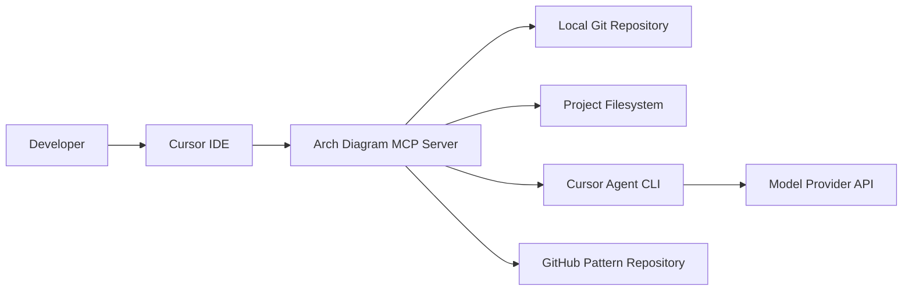
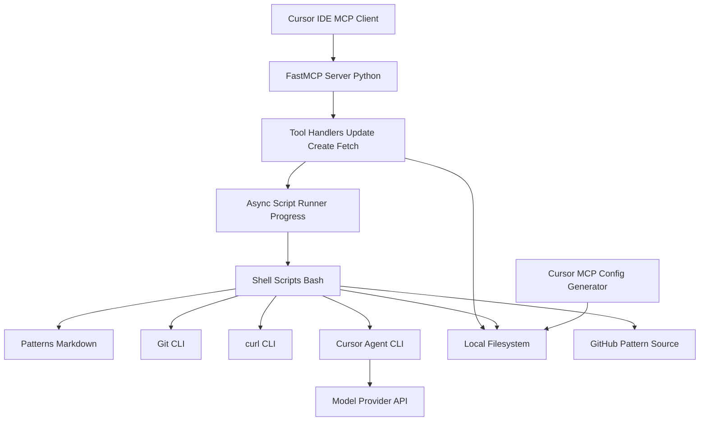
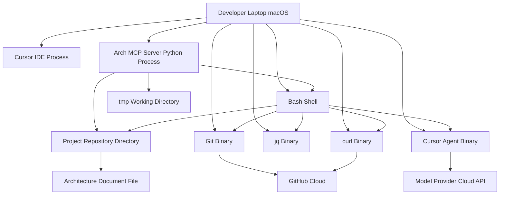

Let me inspect the `arch-diagram-mcp-server` codebase structure and key files to derive the architecture and components. I'll search for project metadata, source modules, entrypoints, and references to frameworks or protocols.## BUSINESS POSTURE

- Purpose: automate creation and updates of architecture design documents with C4 diagrams from local code and git diffs
- Priorities: developer productivity, local-first workflow, reproducibility, fast feedback with progress, minimal setup
- Scope: runs on developer machines, integrated with Cursor via MCP, orchestrates bash scripts and patterns to generate docs
- Constraints: operates within repository boundaries, avoids long-lived processes, supports monorepos and subfolders

Business risks:
- Inaccurate or stale documentation if generation drifts from code or fails silently
- Unintended egress of sensitive repository context to external model providers
- Destructive or misplaced file writes due to path misuse
- Supply chain exposure from external CLIs and remote pattern sources

## SECURITY POSTURE

security control: Subprocess execution via asyncio without shell expansion, no stdin  
security control: Script timeouts and progress reporting to prevent indefinite runs  
security control: Scripts use set -euo pipefail and explicit paths  
security control: Local MCP server only, no exposed network listener in default flow  
security control: Minimal dependencies, Python 3.10+  
security control: Stderr capture and structured parsing of outputs  
security control: Make scripts executable with explicit chmod before run

accepted risk: External model API may receive prompts and summaries from local repo  
accepted risk: Local scripts can modify repository files including documentation  
accepted risk: Dependence on installed git, jq, curl, cursor agent versions  
accepted risk: Remote pattern fetch without strict pinning may introduce drift

Recommended high-priority controls:
- security control: Output path allowlist and filename normalization for generated artifacts
- security control: Dry run mode with diff preview, gated writes by user confirmation
- security control: Egress policy and redaction for prompts to model providers
- security control: Pin dependencies and produce SBOM; periodic vulnerability scans
- security control: Pre-commit hooks for secret scanning and document formatting
- security control: Append-only audit log of tool invocations and file writes
- security control: Checksums or pinned commit ref for fetched patterns
- security control: Configurable git diff base with repo default detection

Security requirements:
- Least privilege file IO within project directories
- Deterministic, idempotent generation to reduce noisy diffs
- TLS for all outbound requests from CLIs; managed API keys
- No PII or secrets in prompts; redact sensitive paths and code
- Clear errors and non-zero exit on partial failures
- Compatibility with enterprise macOS controls and EDR

## DESIGN

### C4 CONTEXT

| Name | Type | Description | Responsibilities | Security controls |
|---|---|---|---|---|
| Developer | Person | Engineer generating architecture docs | Triggers create or update flows | Local-only execution; explicit confirmation for writes |
| Cursor IDE | External System | IDE integrating MCP client | Hosts MCP connection and UI | Sandboxed tool execution, user consent |
| Arch Diagram MCP Server | System | Local FastMCP server exposing tools | Orchestrates scripts, validates inputs, reports progress | No shell expansion, timeouts, stderr capture |
| Local Git Repository | External System | Repo on disk | Provides code and diffs | Read-mostly, controlled write of docs |
| Project Filesystem | External System | Project directories and tmp | Stores generated docs and intermediates | Path allowlist, atomic writes |
| Cursor Agent CLI | External System | CLI to model provider | Generates document content from prompts | Egress policy, key isolation |
| GitHub Pattern Repository | External System | Source of markdown patterns | Supplies prompt templates | HTTPS, pinned ref or checksums |
| Model Provider API | External System | LLM endpoint | Text generation | TLS, token-based auth, rate limits |

### C4 CONTAINER

| Name | Type | Description | Responsibilities | Security controls |
|---|---|---|---|---|
| FastMCP Server Python | Container | Python process using fastmcp | Runs MCP runtime, routes tool calls | Structured logs, no stdin to child processes |
| Tool Handlers Update Create Fetch | Container | Async tool functions | Validate args, orchestrate flows, report progress | Input validation, bounded execution |
| Async Script Runner Progress | Container | Helper for subprocess with progress | Execute scripts, handle timeout, parse output | Timeout, stderr capture, cancellation |
| Shell Scripts Bash | Container | arch sh, fetch fabric pattern sh | Interact with git, cursor agent, jq, curl | set -euo pipefail, explicit binary paths |
| Patterns Markdown | Container | Local pattern files | Prompt templates and formats | Integrity checks, versioning |
| Cursor MCP Config Generator | Container | Optional setup script | Generate MCP client config | Writes to known locations only |
| Git CLI | External Container | System git | Diff, path resolution | Read-only by default |
| curl CLI | External Container | HTTP client | Fetch remote patterns | HTTPS, pinned refs |
| Cursor Agent CLI | External Container | LLM client | Generate content | Egress control, API key isolation |
| Local Filesystem | External Container | Repo and tmp dirs | Persist inputs and outputs | Atomic writes, allowlist paths |
| Model Provider API | External Container | Cloud LLM | Text generation | TLS, auth, quotas |
| GitHub Pattern Source | External Container | Remote repository | Pattern retrieval | TLS, pin commit or checksum |

### C4 DEPLOYMENT

| Name | Type | Description | Responsibilities | Security controls |
|---|---|---|---|---|
| Developer Laptop macOS | Node | Local workstation | Host IDE, server, CLIs | OS hardening, EDR |
| Cursor IDE Process | Process | IDE with MCP client | User interface and tool runner | Sandboxing, consent |
| Arch MCP Server Python Process | Process | FastMCP server | Orchestrate tools and scripts | Limited privileges, resource limits |
| Git Binary | Runtime | System git | Diffs and repo introspection | Read-only operations |
| Cursor Agent Binary | Runtime | External CLI | LLM interaction | Network policy, token isolation |
| jq Binary | Runtime | JSON processor | Parse responses | Trusted source |
| curl Binary | Runtime | HTTP client | Fetch patterns | TLS, pin refs |
| Bash Shell | Runtime | Shell environment | Execute scripts | set -euo pipefail |
| Project Repository Directory | Storage | Source code and docs | Inputs and outputs | Access controls |
| tmp Working Directory | Storage | Ephemeral temp | Prompts and responses | Cleanup policy |
| Architecture Document File | Artifact | Generated doc | Final deliverable | Atomic writes |
| Model Provider Cloud API | Service | Cloud LLM | Text generation | TLS, API keys |
| GitHub Cloud | Service | Remote git hosting | Pattern retrieval | HTTPS, auth if private |

## RISK ASSESSMENT

- Critical business processes to protect: generating initial design documents; updating architecture docs from git diffs; maintaining consistent patterns; producing accurate C4 diagrams with progress and error signaling
- Data to protect and sensitivity: source code and diffs (high, proprietary); architecture documents (medium, internal); prompts and generated outputs (medium, may summarize sensitive code); model provider credentials (high)

## QUESTIONS & ASSUMPTIONS

Questions:
- Should prompts be redacted to avoid sending file contents or secrets to external providers?
- Which model providers are approved and what are the data retention policies?
- Should write operations be gated by dry run and explicit confirmation or PR gates?
- What is the default base for diffs (main, master, trunk) and should it be configurable?
- Must remote pattern fetch be pinned to a commit or use checksums, or should we rely on local patterns only?

Assumptions:
- Runs locally with no exposed network service beyond MCP client connection
- cursor agent, git, jq, curl are available and managed by the developer environment
- Generated docs are intended to be committed to the repository
- Patterns are primarily sourced locally; remote fetch is optional and pinned when enabled
- Monorepo support via subfolder targeting; Python 3.10+ and macOS environment
