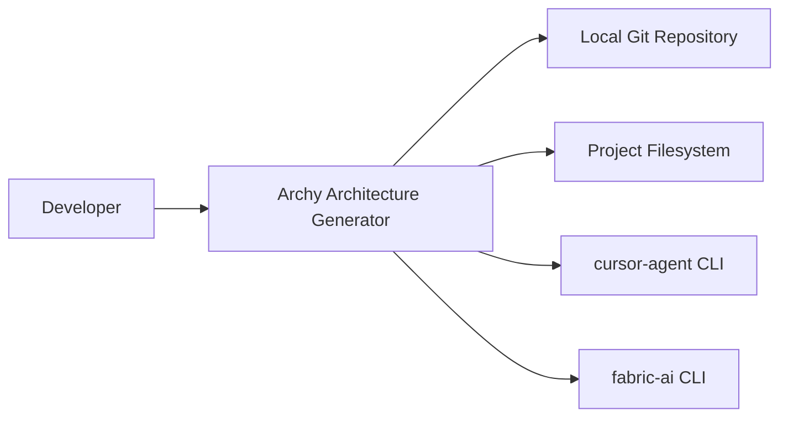
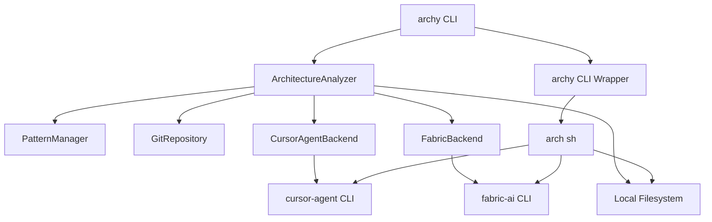
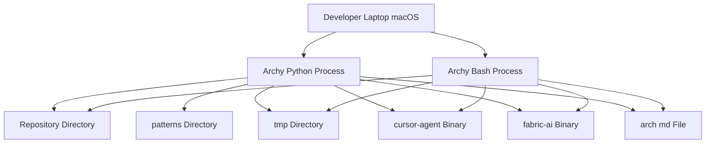

## BUSINESS POSTURE

- Purpose: generate and maintain C4 architecture documentation from local repositories using AI backends
- Priorities: developer productivity, local-first execution, deterministic outputs, minimal setup, fast feedback
- Scope: local macOS developer machines, Python CLI and bash wrappers, integrates with cursor-agent and fabric-ai
- Constraints: operates within git repo boundaries, respects .gitignore, avoids long-lived processes, strict Mermaid rules via patterns
- Business risks:
  - Stale or inaccurate docs if updates miss relevant changes
  - Unintended data egress to external AI providers via cursor-agent or fabric-ai
  - Misplaced or destructive writes without path validation
  - Dependency on external CLI tools availability and versions

## SECURITY POSTURE

- security control: Path traversal prevention for `project_path` and `subfolder` in `ArchyConfig`
- security control: Filename allowlist for `arch_filename` in `ArchyConfig`
- security control: Write permission checks for target directories and files
- security control: Excluded patterns to avoid lock files and build artifacts in analysis
- security control: AI subprocess calls use timeouts and captured stdio
- security control: Bash scripts use set -euo pipefail, mktemp with 700 perms, EXIT traps for cleanup
- security control: Supported backend allowlist: cursor-agent, fabric-ai
- security control: Prompts and outputs stored locally under repo directories

- accepted risk: Code and diffs may be summarized and sent to AI backends via cursor-agent or fabric-ai
- accepted risk: Local scripts and CLI can modify repo files such as `arch.md`
- accepted risk: Dependence on installed versions of cursor-agent, fabric-ai, git, jq

Recommended high-priority controls:
- security control: Redaction of secrets and sensitive paths before prompt assembly
- security control: Output path allowlist and atomic file writes for `arch.md`
- security control: Pre-commit hooks for secret scans and Mermaid validation
- security control: Dependency pinning with SBOM and periodic vulnerability scans
- security control: Optional dry-run mode with diff preview before write

Security requirements:
- Least-privilege file IO within the repo
- Deterministic, idempotent generation to minimize noisy diffs
- TLS for any outbound backend communications handled by cursor-agent or fabric-ai
- Clear errors and non-zero exit on partial failures
- Compatibility with enterprise macOS defenses and auditing

## DESIGN

### C4 CONTEXT

| Name | Type | Description | Responsibilities | Security controls |
|---|---|---|---|---|
| Developer | Person | Engineer using the tool | Runs fresh or update flows | OS user permissions, interactive control |
| Archy Architecture Generator | System | Local documentation generator | Analyze repo, create or update `arch.md` | Path validation, timeouts, excluded patterns |
| Local Git Repository | External System | Git repo on disk | Source of tracked files and diffs | Read-only access from analyzer |
| Project Filesystem | External System | Repo and temp directories | Store prompts and generated docs | Atomic writes, directory allowlist |
| cursor-agent CLI | External System | Cursor agent command line | Invoke LLM to generate content | Limited egress via CLI, timeouts |
| fabric-ai CLI | External System | Fabric AI command line | Invoke LLM with local or configured models | Limited egress, stderr handling |

### C4 CONTAINER

| Name | Type | Description | Responsibilities | Security controls |
|---|---|---|---|---|
| archy CLI | Container | Typer-based Python CLI | fresh, update, test, version commands | Argument validation, error handling |
| ArchitectureAnalyzer | Container | Orchestration engine | Builds prompts, calls backends, writes docs | Timeout use, response cleaning |
| PatternManager | Container | Pattern loader | Loads `create_design_document_pattern.md`, `update_arch_diagram_pattern.md` | Local, versioned patterns |
| GitRepository | Container | GitPython wrapper | Detects default branch, diffs, tracked files | Scoped path filters, excludes |
| CursorAgentBackend | Container | Backend adapter | Runs `cursor-agent -p --output-format json` | Timeouts, error capture |
| FabricBackend | Container | Backend adapter | Pipes prompt to `fabric-ai`, normalizes output | Error inspection, fallback handling |
| archy CLI Wrapper | Container | Bash wrapper script | Parses flags, calls `arch.sh` | set -euo pipefail, allowlisted backends |
| arch sh | Container | Bash orchestrator | Full and change-driven flows via CLI tools | mktemp 700, cleanup traps, jq normalization |
| Local Filesystem | External Container | Repo and tmp dirs | Persist prompts and `arch.md` | Write checks, path validation |
| cursor-agent CLI | External Container | AI backend tool | LLM invocation via Cursor | Separate binary, versioned |
| fabric-ai CLI | External Container | AI backend tool | LLM invocation via Fabric | Separate binary, versioned |

### C4 DEPLOYMENT

| Name | Type | Description | Responsibilities | Security controls |
|---|---|---|---|---|
| Developer Laptop macOS | Node | Local workstation | Host Python and bash processes | OS hardening, EDR |
| Archy Python Process | Process | `archy` Typer app | Analyze repo, call backends, write doc | Timeouts, validations |
| Archy Bash Process | Process | `scripts/arch.sh` | Orchestrate via git, jq, backends | mktemp, cleanup, error traps |
| cursor-agent Binary | Runtime | Cursor CLI tool | Execute AI requests | Network policy via OS |
| fabric-ai Binary | Runtime | Fabric CLI tool | Execute AI requests | Network policy via OS |
| Repository Directory | Storage | Project files | Inputs for analysis | Access controls |
| patterns Directory | Storage | Prompt patterns | Deterministic templates | Version control |
| arch md File | Artifact | Generated document | Final C4 and design content | Atomic writes |
| tmp Directory | Storage | Ephemeral workspace | Prompts and responses | 700 perms, cleanup |

## RISK ASSESSMENT

- Critical business processes to protect: creating fresh architecture docs; updating docs from git diffs; testing backend connectivity; deterministic documentation writes
- Data to protect and sensitivity: source code and diffs high; prompts and generated docs medium; API keys for backends high

## QUESTIONS & ASSUMPTIONS

Questions:
- Which model providers behind cursor-agent and fabric-ai are approved and what are retention policies
- Should prompts include code snippets or only summaries with redaction
- Should writes to `arch.md` be gated by dry-run and explicit confirmation
- What default base branch should be used when origin head is absent

Assumptions:
- Execution is local-only; no long-lived services
- `cursor-agent`, `fabric-ai`, `git`, and `jq` are installed and available
- Generated `arch.md` is committed to the repository
- Patterns are sourced from the local `patterns` directory and reviewed in code review